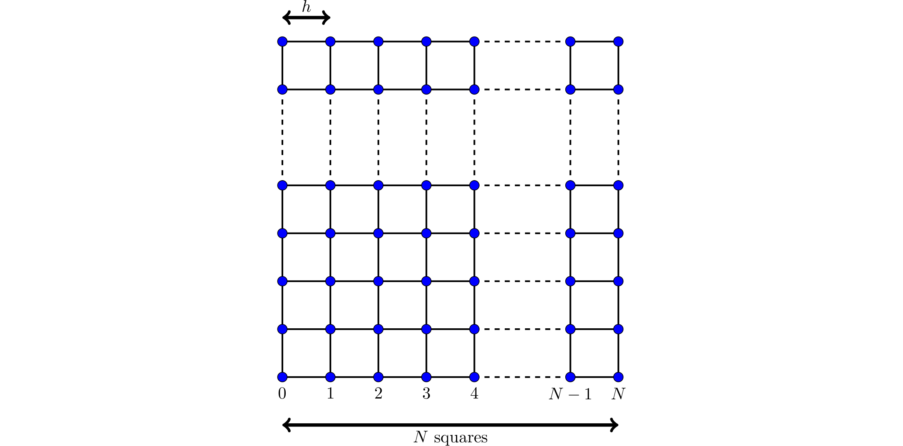

# Assignment 4 - Solving a finite element system

This assignment makes up 30% of the overall marks for the course. The deadline for submitting this assignment is **5pm on Thursday 15 December 2022**.

Coursework is to be submitted using the link on Moodle. You should submit a single pdf file containing your code, the output when you run your code, and your answers
to any text questions included in the assessment. The easiest ways to create this file are:

- Write your code and answers in a Jupyter notebook, then select File -> Download as -> PDF via LaTeX (.pdf).
- Write your code and answers on Google Colab, then select File -> Print, and print it as a pdf.

Tasks you are required to carry out and questions you are required to answer are shown in bold below.

## The assignment

### Mathematical background
In this assignment, we are going to solve a Helmholtz wave problem:

$$\begin{align*}
-\Delta u - k^2u &= 0&\text{in }\Omega,\\
u &= g&\text{on the boundary of }\Omega.
\end{align*}$$

As our domain we will use the unit square, ie $\Omega=[0,1]^2$.
In this assignment, we will use $k=5$ and

$$
g(x,y)=
\begin{cases}
\sin(4y)&\text{if }x=0,\\
\sin(3x)&\text{if }y=0,\\
\sin(3+4y)&\text{if }x=1,\\
\sin(3x+4)&\text{if }y=1.
\end{cases}
$$

The finite element method is a method that can approximately solve problems like this. We first split the square $[0,1]^2$ into a mesh of $N$ squares by $N$ squares
(or $N+1$ points by $N+1$ points - 
note that there are $N$ squares along each side, but $N+1$ points along each side (watch out for off-by-one errors)):

As shown in the diagram, we let $h=1/N$.

The (degree 1) finite element method looks for an approximate solution by placing an unknown value/variable at each point, and approximating the solution as some
linear combination of the functions $1$, $x$, $y$ and $xy$ inside each square. Re-writing the problem as an integral equation (and doing a bit of algebra) allows
us to turn the problem into the matrix vector problem

$$\mathrm{A}\mathbf{x}=\mathbf{b}.$$

(We do not need to go into details of how this method is derived, but if you're curious, the first chapter of
*Numerical Solution of Partial Differential Equations by the Finite Element Method* by Claes Johnson
gives a good introduction to this method.)

Let $\mathbf{p}_0$, $\mathbf{p}_1$, ..., $\mathbf{p}_{(N-1)^2-1}$ be the points in our mesh that are not on the boundary (in some order). Let $x_0$, $x_1$, ..., $x_{(N-1)^2-1}$ be
the values/variables at the points (these are the entries of the unknown vector $\mathbf{x}$).

$\mathrm{A}$ is an $(N-1)^2$ by $(N-1)^2$ matrix. $\mathbf{b}$ is a vector with $(N-1)^2$ entries. The entries $a_{i,j}$ and $b_j$ of the matrix $\mathrm{A}$ and vector $\mathbf{b}$ are given by

$$\begin{align*}
a_{i,j} &=\begin{cases}
\displaystyle
\frac{24-4h^2k^2}{9}&\text{if }i=j\\
\displaystyle
\frac{-3-h^2k^2}{9}
&\text{if }\mathbf{p}_i\text{ and }\mathbf{p}_j\text{ are horizontally or vertically adjacent}\\
\displaystyle
\frac{-12-h^2k^2}{36}
&\text{if }\mathbf{p}_i\text{ and }\mathbf{p}_j\text{ are diagonally adjacent}\\
0&\text{otherwise}
\end{cases}\\[1cm]
b_{j} &=\begin{cases}
\displaystyle
\frac{12+h^2k^2}{36} g(0,0)+\frac{3+h^2k^2}{9}\left(g(h,0)+g(0, h)\right)
&\text{if }\mathbf{p}_j=(h,h)\\
\displaystyle
\frac{12+h^2k^2}{36} g(1,0)+\frac{3+h^2k^2}{9}\left(g(1-h,0)+g(1, h)\right)
&\text{if }\mathbf{p}_j=(1-h,h)\\
\displaystyle
\frac{12+h^2k^2}{36} g(0,1)+\frac{3+h^2k^2}{9}\left(g(h,1)+g(0, 1-h)\right)
&\text{if }\mathbf{p}_j=(h,1-h)\\
\displaystyle
\frac{12+h^2k^2}{36} g(1,1)+\frac{3+h^2k^2}{9}\left(g(1-h,1)+g(1, 1-h)\right)
&\text{if }\mathbf{p}_j=(1-h,1-h)\\
\\[3mm]
\displaystyle
\frac{3+h^2k^2}{9} g(0,b_j)
&\text{if }\mathbf{p}_j=(h,b_j)\text{, with }b_j\not=h\text{ and }b_j\not=1-h\\
\displaystyle
\frac{3+h^2k^2}{9} g(1,b_j)
&\text{if }\mathbf{p}_j=(1-h,b_j)\text{, with }b_j\not=h\text{ and }b_j\not=1-h\\
\displaystyle
\frac{3+h^2k^2}{9} g(a_j,0)
&\text{if }\mathbf{p}_j=(a_j,h)\text{, with }a_j\not=h\text{ and }a_j\not=1-h\\
\displaystyle
\frac{3+h^2k^2}{9} g(a_j,1)
&\text{if }\mathbf{p}_j=(a_j,1-h)\text{, with }a_j\not=h\text{ and }a_j\not=1-h
\\[3mm]
0&\text{otherwise}
\end{cases}
\end{align*}$$

For example (using $k$ and $g$ as given above) when $N=2$, 

$$
\mathrm{A}=\begin{pmatrix}
-0.11111111
\end{pmatrix}.
$$

For $N=2$, the definition of $\mathbf{b}$ is different to above, as the point at $(1/2,1/2)$ is adjecent to all three sides.

As as second example, when $N=3$,

$$
\mathrm{A}=\begin{pmatrix}
 1.43209877& -0.64197531& -0.64197531& -0.41049383\\
-0.64197531&  1.43209877& -0.41049383& -0.64197531\\
-0.64197531& -0.41049383&  1.43209877& -0.64197531\\
-0.41049383& -0.64197531& -0.64197531&  1.43209877
\end{pmatrix},
$$

$$
\mathrm{b}=\begin{pmatrix}
1.85116856\\0.35362119\\-0.11199319\\-0.72940276
\end{pmatrix}.
$$

In this second example, I have numbered the points like this:

$$
\begin{array}{cc}
2&3\\
0&1
\end{array}
$$

### Part 1: creating the matrix and vector
**Write a function that takes $N$ as an input and returns the matrix $\mathrm{A}$ and the vector $\mathbf{b}$**. The matrix should be stored using an appropriate sparse format - you may use Scipy for this, and do not need to implement your own format.

You can find [example matrices and vectors for $N=2$, $N=3$, and $N=4$ here](2022-a4-A_and_b.md). You may wish to use them to validate your function, but you do not need to include this validation as
part of the assignment.

### Part 2: solving the system
Solving the matrix-vector problem will lead to an approximate solution to the Helmholtz problem:
we call this approximate solution $u_h$.

Using any matrix-vector solver, **solve the matrix-vector problem for $N=4$, $N=8$, and $N=16$** and **plot the approximate solutions
to the Helmholtz problem**. To plot
the solutions, you can pass the $x$- and $y$-coordinates of the points and the value of $u_h$ at each
point into matplotlib's 3D plotting function. For the points on the boundary, the value of $u_h$ is
given by the function $g$; for interior points, the value will be one of the entries of the solution
vector $\mathbf{x}$.

An example of 3D plotting in matplotlib can be found in the [sparse PDE example](sparse_linalg_pde.ipynb) from earlier in the course.

### Part 3: comparing solvers and preconditioners
In this section, your task is to evaluate the performance of various matrix-vector solvers.
To do this, **solve the matrix-vector problem with small to medium sized value of $N$ using a range of different solvers of your choice,
measuring factors you deem to be important for your evaluation.** These factors should include
the time taken by the solver, and may additionally include many other thing such as the number of
iterations taken by an iterative solver, or the size of the residual after each iteration.
**Make a set of plots that show the measurements you have made and allow you to compare the solvers**.

You should compare at least five matrix-vector solvers: at least two of these should be iterative
solvers, and at least one should be a direct solver. You should use some solvers from the Scipy
library and some from PETSc. (You may optionally use additional solvers from other linear algebra
libraries, but you do not need to do this to achieve high marks. You should use solvers from these libraries and do not need to implement your own solvers.)
For two of the iterative solvers you have chosen to use,
**repeat the comparisons with three different choices of preconditioner**.

Based on your experiments, **pick a solver** (and a preconditioner if it improves the solver)
that you think is most appropriate to solve this matrix-vector problem. **Explain, making use
of the data from your experiments, why this is the best solver for this problem**.

### Part 4: increasing $N$
In this section, you are going to use the solver you picked in part 3 to compute the solution
for larger values of $N$.

The problem we have been solving in this assignment has the exact solution $u_\text{exact}=\sin(3x+4y)$.
A measure of the error of an approximate solution $u_h$ can be computed using

$$
\sum_{i=0}^{N-1} h^2\left|u_\text{exact}(\mathbf{m}_i)-u_h(\mathbf{m}_i)\right|,
$$

where $\mathbf{m}_i$ is the midpoint of the $i$th square in the finite element mesh: the value of
$u_h$ at this midpoint will be the mean of the values at the four corners of the square.

For a range of values of $N$ from small to large, **compute the solution to the matrix-vector
problem**. **Measure the time taken to compute this solution**, and **compute the error of the solution**.
**Make plots showing the time taken and error as $N$ is increased**.

Using your plots, **estimate the complexity of the solver you are using** (ie is it $\mathcal{O}(N)$?
Is it $\mathcal{O}(N^2)$?), and **estimate the order of convergence of your solution** (your error
should decrease like $\mathcal{O}(N^{-\alpha})$ for some $\alpha>0$). Briefly (1-2 sentences)
**comment on how you have made these estimates of the complexity and order.**

### Part 5: parallelisation
In this section, we will consider how your solution method could be parallelised; you do not need,
however, to implement a parallel version of your solution method.

**Comment on how your solution method could be parallelised.** Which parts (if any) would be trivial
to parallelise? Which parts (if any) would be difficult to parallelise? By how much would you expect
parallelisation to speed up your solution method?
